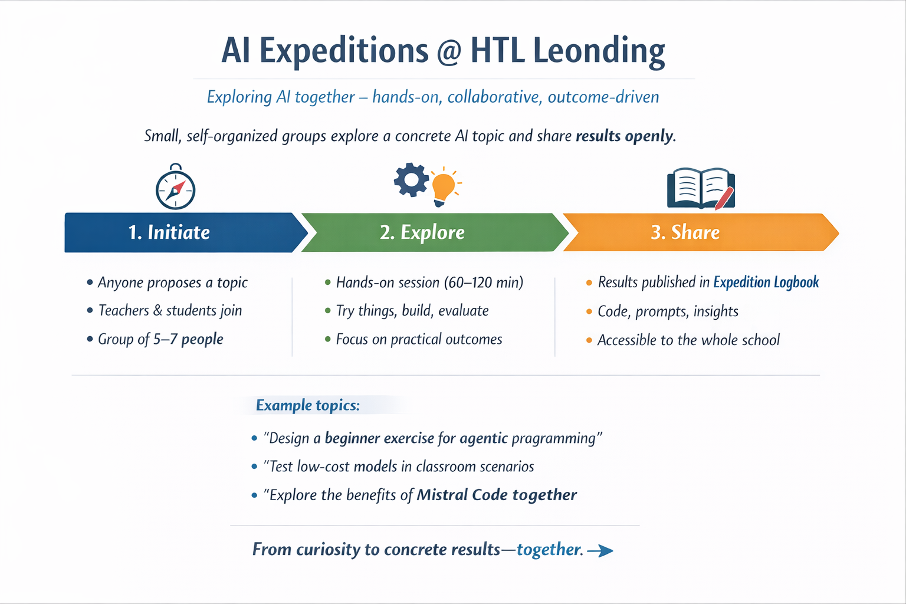

# AI Expeditions @ HTL Leonding

Exploring AI together – hands-on, collaborative, outcome-driven.

---

---

## 🧭 What are AI Expeditions?

AI Expeditions are small, self-organized sessions where students and teachers explore practical applications of AI together.

- voluntary participation
- small groups (5–7 people)
- hands-on experimentation
- open sharing of results

---

## ⚙️ How it works

**1. Initiate**  
Anyone proposes a topic and invites participants.

**2. Explore**  
A small group meets to experiment, build, and evaluate ideas.

**3. Share**  
Results are published in the **Expedition Logbook**.

---

## 📓 Expedition Logbook

Each expedition produces a short logbook entry including:

- topic and goal
- key findings
- prompts, code, materials
- lessons learned

All results are shared openly within this organization.

---

## 🚀 Example Topics

- Designing exercises for agentic programming
- Evaluating low-cost AI models
- Exploring new AI tools
- Improving prompting strategies

---

## 🤝 Join an Expedition

Interested? Join an upcoming expedition or start your own.

👉 From curiosity to concrete results—together.
